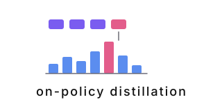

<p align="center">
  
</p>

OPD is an on-policy distillation trainer for research and teaching. See [docs/superpowers/specs/](docs/superpowers/specs/) for design and implementation plans.

## Quickstart

```bash
python -m venv .venv && .venv/bin/pip install -e ".[dev]"
./scripts/run_lab.sh
.venv/bin/opd export-explorer --run runs/<latest_run_dir> --out explorer/public/data/runs/my-run.json
cd explorer && npm install && npm run dev
```

Tutorials:

- [01 — Three Pools on CPU](docs/tutorials/01_three_pools.md): the mechanics — rollout, teacher, train, sync.
- [02 — Why On-Policy Distillation Works](docs/tutorials/02_on_policy_distillation.md): the math — reverse-KL derivation, on-policy vs SFT, the RL connection.
